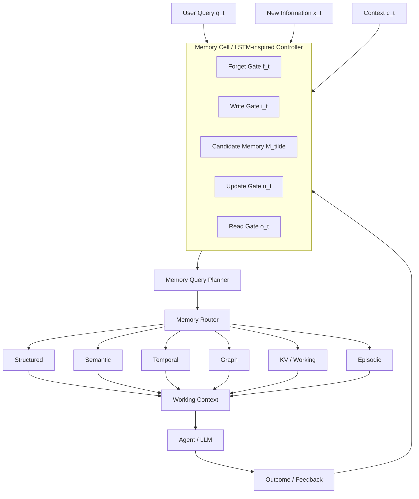

<div align="center">

<picture>
  
</picture>

# Membrane

**The programmable memory layer for AI agents.**

[](https://pypi.org/project/membrane-memory/)
[](https://pypi.org/project/membrane-memory/)
[](https://opensource.org/licenses/Apache-2.0)

</div>

---

## What is Membrane?

Membrane is a **programmable memory runtime for AI agents**.

> **Memory should be managed like a computational resource, not retrieved like a document collection.**

Traditional RAG is usually:

```text
query → embed → vector search → context
```

Membrane is:

```text
query / event
      ↓
memory controller
      ↓
read · write · update · forget
      ↓
memory query planner
      ↓
memory router
      ↓
structured · semantic · temporal · graph · KV · episodic
      ↓
rank · merge · budget · explain
      ↓
working context
```

The core is **LLM-optional**. Deterministic memory management works locally without an API key or mandatory vector database.

## Quickstart

```bash
pip install membrane-memory
```

```python
from membrane import Memory

memory = Memory()

memory.remember(
    "The user prefers concise technical explanations.",
    user_id="alice_123",
)

result = memory.recall(
    "How should I communicate with this user?",
    user_id="alice_123",
)

print(result.memories[0].content)
```

SQLite is the default local substrate.

---

# Architecture


The architecture separates the **memory control plane** from the **memory data plane**.



### Critical design distinction

The LSTM-inspired component is a **memory controller**, not an LSTM-shaped database.

A vanilla LSTM has a dense cell state. Membrane uses a compact controller state to produce policies over external, heterogeneous memory.

This makes the LSTM analogy useful without pretending SQL rows, graph nodes, and vector records are literally an LSTM cell tensor.

---

# Memory Gates

Define:

```text
z_t = [q_t ; x_t ; c_t ; h_{t-1}]
```

### Forget gate

```text
f_t = σ(W_f z_t + b_f)
```

Controls retention, decay, expiration, and removal from active memory.

### Write gate

```text
i_t = σ(W_i z_t + b_i)
```

Controls admission of new observations.

### Candidate memory

```text
M̃_t = φ(W_m z_t + b_m)
```

Represents proposed new memory.

### Update gate

```text
u_t = σ(W_u z_t + b_u)
```

Controls revision and supersession.

### LSTM-inspired state update

```text
M̄_t = f_t ⊙ M_{t-1} + i_t ⊙ M̃_t

M_t = (1-u_t) ⊙ M_{t-1} + u_t ⊙ M̄_t
```

### Read gate

```text
o_t = σ(W_o [h_t ; q_t] + b_o)

R_t = o_t ⊙ Retrieve(Plan(q_t, c_t), M)
```

The read gate controls how much selected memory enters working context.

---

# Memory Lifecycle

```text
CANDIDATE
    │
    ├── accepted ───────► ACTIVE
    │                       │
    │                       ├── revised ──► UPDATED / SUPERSEDED
    │                       ├── stale ────► ARCHIVED
    │                       └── expired ──► FORGOTTEN
    │
    └── unsafe ─────────► QUARANTINED
```

Every transition is intended to be auditable rather than silently destructive.

---

# Memory Query Planner

Not every memory query is semantic search.

| Query | Preferred substrate |
|---|---|
| What does the user prefer? | Semantic |
| What is the current price? | Structured / KV |
| What changed last week? | Temporal |
| Who is connected to this project? | Graph |
| What happened during the previous run? | Episodic |
| What is the latest state? | KV / Structured |
| Why was this decision made? | Hybrid + Provenance |

The planner produces an inspectable plan before execution.

---

# Memory Substrates

| Substrate | Purpose | Example |
|---|---|---|
| Structured | exact facts and attributes | SQLite / PostgreSQL |
| Semantic | conceptual similarity | Qdrant / pgvector |
| Temporal | history and point-in-time state | SQL / event log |
| Graph | relationships and causal links | Neo4j |
| KV / Working | current state and fast lookup | Redis / SQLite |
| Episodic | events and artifacts | object store / filesystem |

Membrane does not require all substrates to be installed.

---

# Temporal Memory

Current truth and historical truth are different queries.

```python
memory.remember(
    "SKU 123 price is $10",
    structured={"entity": "sku_123", "attribute": "price", "value": 10},
)

memory.remember(
    "SKU 123 price is $12",
    structured={"entity": "sku_123", "attribute": "price", "value": 12},
)

memory.recall("current price", entity="sku_123")
memory.timeline("sku_123")
```

The current record can supersede the previous record while the historical record remains recoverable.

---

# Provenance and Outcome Memory

Membrane tracks the path:

```text
source
  ↓
observation
  ↓
memory candidate
  ↓
gate decision
  ↓
stored / superseded memory
  ↓
retrieval plan
  ↓
working context
  ↓
agent decision
  ↓
outcome
```

This enables outcome-based reinforcement:

```text
decision → action → outcome → utility → memory policy update
```

---

# Security

Memory is an attack surface.

Untrusted instruction-like observations should be isolated:

```text
untrusted observation
        ↓
   trust / policy gate
       / \
      /   \
 trusted  suspicious
   ↓          ↓
 ACTIVE   QUARANTINED
```

Policies can control tenant isolation, source trust, retention, write permissions, sensitive fields, and retrieval scope.

---

# Research Direction

The central research question is:

> **Can an AI system dynamically manage heterogeneous memory as a computational resource?**

Potential research dimensions:

- learned memory gating
- temporal contradiction resolution
- adaptive forgetting
- consolidation
- outcome-based reinforcement
- substrate routing
- context-budget optimization
- LLM-free memory control
- replay

A future **MemoryBench** should measure retrieval quality, temporal correctness, contradiction rate, write/forget precision, consolidation quality, latency, storage growth, and token consumption.

## Design Principles

1. **Memory is not RAG.** Semantic retrieval is only one mechanism.
2. **Control and storage are separate.**
3. **Exact facts should remain structured.**
4. **History should be preserved.**
5. **Memory should be budget-aware.**
6. **LLMs are optional infrastructure.**
7. **Important decisions should be explainable.**

## Contributing

```bash
git clone https://github.com/dcsgod/membrane.git
cd membrane
pip install -e ".[dev]"
pytest
```

## License

Apache 2.0.
