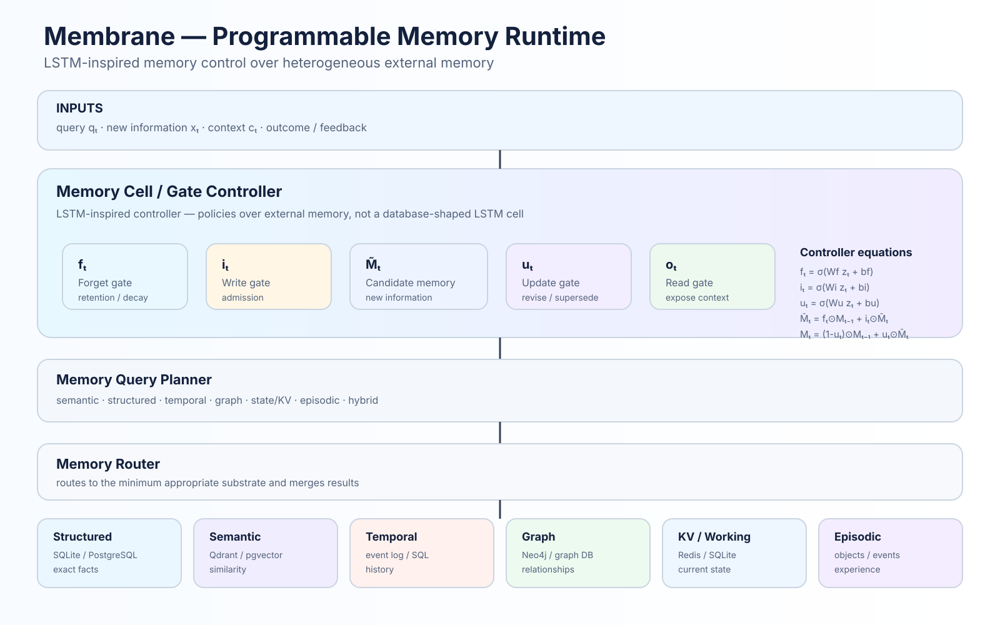
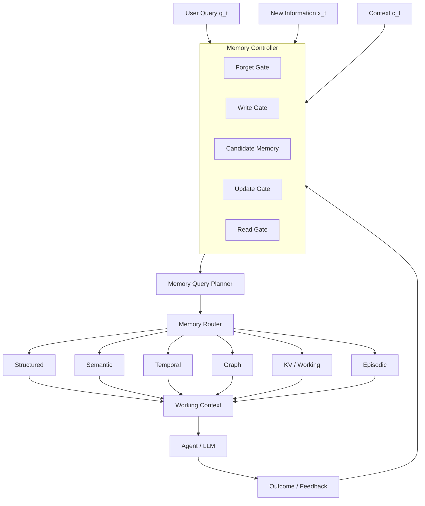

<div align="center">


# Membrane

### Programmable memory runtime for AI agents, LLMs and agentic systems.

**Membrane** is an open-source **AI agent memory framework** that manages structured, semantic, temporal, graph, working/KV and episodic memory with explicit read, write, update and forget operations.

**Memory should be managed like a computational resource, not retrieved like a document collection.**

[](https://pypi.org/project/membrane-memory/)
[](https://pypi.org/project/membrane-memory/)
[](https://opensource.org/licenses/Apache-2.0)

[Quickstart](#quickstart) · [How It Works](#how-it-works) · [Memory Lifecycle](#memory-lifecycle) · [Temporal Memory](#temporal-memory) · [Security](#security) · [Research](#research-direction)

</div>

---

## Why Membrane?

Most agent memory systems reduce to:

```text
query → embed → vector search → context
```

That works for similarity. It is not enough for **state, history, contradiction, forgetting, provenance, or exact facts**.

Membrane treats memory as a managed runtime:

```text
query / event
      │
      ▼
memory controller
      │
      ├── read
      ├── write
      ├── update
      └── forget
      │
      ▼
memory query planner
      │
      ▼
memory router
      │
      ├── structured
      ├── semantic
      ├── temporal
      ├── graph
      ├── KV / working
      └── episodic
      │
      ▼
rank · merge · budget · explain
      │
      ▼
working context
```

The core is **LLM-optional** and **local-first**. Membrane can manage memory without an API key, Docker, or a mandatory vector database.

---

## Quickstart

### Install

```bash
pip install membrane-memory
```

### Remember and recall

```python
from membrane import Memory

memory = Memory()

memory.remember(
    "The user prefers concise technical explanations.",
    user_id="alice_123",
)

result = memory.recall(
    "How should I communicate with this user?",
    user_id="alice_123",
)

print(result.memories[0].content)
```

### Persistent local memory

SQLite is the default local substrate.

```python
memory = Memory(db_path="membrane.db")
```

Use an explicit database path when memory should survive process restarts.

---

# How It Works

Membrane separates the **memory control plane** from the **memory data plane**.





### The LSTM connection

Membrane is **LSTM-inspired, not an LSTM database**.

A conventional LSTM maintains a dense hidden/cell state. Membrane instead uses a compact controller state to produce policies over external, heterogeneous memory.

The analogy is useful because the controller has distinct operations for:

| Gate | Memory responsibility |
|---|---|
| **Write** | Should this observation enter memory? |
| **Update** | Does this observation revise an existing fact? |
| **Forget** | Should memory decay, expire, or leave active state? |
| **Read** | Which memory should enter working context? |

This preserves the useful idea of gated state management without pretending that SQL rows, graph nodes, and vector records are an LSTM tensor.

---

# Memory Gates

A conceptual controller can be expressed as:

```text
z_t = [q_t ; x_t ; c_t ; h_{t-1}]
```

### Forget

```text
f_t = σ(W_f z_t + b_f)
```

Controls retention, decay, expiration, and removal from active memory.

### Write

```text
i_t = σ(W_i z_t + b_i)
```

Controls admission of new observations.

### Candidate

```text
M̃_t = φ(W_m z_t + b_m)
```

Represents proposed new memory.

### Update

```text
u_t = σ(W_u z_t + b_u)
```

Controls revision and supersession.

### State update

```text
M̄_t = f_t ⊙ M_{t-1} + i_t ⊙ M̃_t

M_t = (1-u_t) ⊙ M_{t-1} + u_t ⊙ M̄_t
```

### Read

```text
o_t = σ(W_o [h_t ; q_t] + b_o)

R_t = o_t ⊙ Retrieve(Plan(q_t, c_t), M)
```

The read policy controls which selected memory is allowed into the working context.

---

# Memory Lifecycle

Memory is treated as a state machine rather than an append-only pile of text.

```text
                         ┌──────────────┐
                         │   CANDIDATE  │
                         └──────┬───────┘
                                │
                    ┌───────────┴───────────┐
                    │                       │
                 accepted                 unsafe
                    │                       │
                    ▼                       ▼
                 ACTIVE               QUARANTINED
                    │
          ┌─────────┼──────────┐
          │         │          │
       revised    stale      expired
          │         │          │
          ▼         ▼          ▼
     SUPERSEDED  ARCHIVED   FORGOTTEN
```

The underlying model also represents written, rejected, and consolidated states.

The goal is **auditable memory transitions instead of silent mutation or deletion**.

---

# Memory Query Planning

Not every memory question is a semantic-search problem.

| Question | Preferred memory strategy |
|---|---|
| What does the user prefer? | Semantic |
| What is the current price? | Structured / KV |
| What changed last week? | Temporal |
| Who is connected to this project? | Graph |
| What happened during the previous run? | Episodic |
| What is the latest state? | KV / Structured |
| Why was this decision made? | Hybrid + provenance |

The planner can produce an inspectable plan before retrieval.

This is the central shift:

> **Retrieve the right kind of memory, not merely the most similar text.**

---

# Memory Substrates

Membrane is designed around heterogeneous memory rather than a single storage primitive.

| Substrate | Purpose | Example backend |
|---|---|---|
| **Structured** | Exact facts and attributes | SQLite, PostgreSQL |
| **Semantic** | Conceptual similarity | Qdrant, pgvector |
| **Temporal** | History and point-in-time state | SQL, event log |
| **Graph** | Relationships and causal links | Graph database |
| **KV / Working** | Current state and fast lookup | SQLite, Redis |
| **Episodic** | Events and artifacts | Filesystem, object store |

You do not need to install every substrate. The local core starts with SQLite.

---

# Temporal Memory

**Current truth and historical truth are different queries.**

Structured fields allow exact facts to be represented independently of semantic similarity.

```python
memory.remember(
    "SKU 123 price is $10",
    structured={
        "entity": "sku_123",
        "attribute": "price",
        "value": 10,
    },
)

memory.remember(
    "SKU 123 price is $12",
    structured={
        "entity": "sku_123",
        "attribute": "price",
        "value": 12,
    },
)

current = memory.recall("current price", entity="sku_123")
history = memory.timeline("sku_123")
```

A newer fact can supersede an older fact while the historical record remains recoverable.

This distinction matters for agents that need to answer both:

```text
"What is true now?"
```

and:

```text
"What was true then?"
```

---

# Provenance and Explainability

Memory should not become a black box.

Membrane models a trace from source to outcome:

```text
source
  ↓
observation
  ↓
memory candidate
  ↓
gate decision
  ↓
stored / superseded memory
  ↓
retrieval plan
  ↓
working context
  ↓
agent decision
  ↓
outcome
```

Retrieval results carry identifiers, scores, plans, dropped candidates, and provenance so memory decisions can be inspected.

This also enables a future feedback loop:

```text
decision → action → outcome → utility → memory policy update
```

---

# Security

Memory is an attack surface.

Untrusted instruction-like observations should not automatically become trusted agent context.

```text
untrusted observation
        │
        ▼
   trust / policy gate
      /       \
     /         \
 trusted     suspicious
    │             │
    ▼             ▼
 ACTIVE       QUARANTINED
```

The memory model includes:

- trust tiers
- namespace isolation
- provenance
- retention and expiration
- write permissions
- sensitive-field handling
- retrieval scope
- tamper-evident event chaining

---

# Agent Integration

Membrane is intended to sit beside your agent framework rather than replace it.

```text
User
 │
 ▼
Agent / Orchestrator
 │
 ├──────────────► Membrane.recall()
 │                    │
 │                    ▼
 │              curated context
 │
 ▼
LLM / Tools
 │
 └──────────────► Membrane.remember()
```

Optional integrations are available through package extras:

```bash
pip install "membrane-memory[mcp]"
pip install "membrane-memory[server]"
pip install "membrane-memory[embeddings-local]"
```

---

# Design Principles

1. **Memory is not RAG.** Semantic retrieval is one mechanism, not the memory model.
2. **Control and storage are separate.** Policies decide what memory should do; substrates store it.
3. **Exact facts remain structured.** Do not use embeddings for every question.
4. **History matters.** Supersession should not erase the past.
5. **Memory is budget-aware.** Working context is a constrained resource.
6. **LLMs are optional infrastructure.** Core memory management can remain deterministic.
7. **Important decisions should be explainable.** Retrieval and lifecycle decisions should be inspectable.
8. **Security belongs inside the memory layer.** Untrusted observations should be treated as untrusted data.

---

# Research Direction

The central research question is:

> **Can an AI system dynamically manage heterogeneous memory as a computational resource?**

Areas of interest include:

- learned memory gating
- temporal contradiction resolution
- adaptive forgetting
- memory consolidation
- outcome-based reinforcement
- substrate routing
- context-budget optimization
- LLM-free memory control
- replay and memory evaluation

A future **MemoryBench** should measure:

| Dimension | Example metric |
|---|---|
| Retrieval | relevance, recall, precision |
| Temporal | point-in-time correctness |
| Lifecycle | write / update / forget precision |
| Consistency | contradiction rate |
| Consolidation | information retention |
| Efficiency | latency and storage growth |
| Context | token consumption |
| Explainability | provenance completeness |

---

# Project Status

Membrane is currently **alpha software**.

The project is intentionally designed as a research-oriented foundation for programmable agent memory. APIs and storage abstractions may evolve as the runtime matures.

---

# Development

```bash
git clone https://github.com/dcsgod/membrane.git
cd membrane

pip install -e ".[dev]"

pytest
```

For local experimentation:

```bash
membrane --help
```

---

# License

Apache 2.0.

---

<div align="center">

**Membrane**

*Programmable memory for agents.*

[PyPI](https://pypi.org/project/membrane-memory/) · [GitHub](https://github.com/dcsgod/membrane)

</div>
